# We'll cover
- Building a simple graphQL server
- Generate a typed client with Strawberryshake
- Setup a testing project to assert the API is working
  - Look at the different strategies on how to test
  - Testing cross cutting concerns (Authentication + Authorization)

## GraphQL with .NET

In general, there are two projects if you want to create a graphQL server with .NET

- `Graphql-dotnet` https://github.com/graphql-dotnet/graphql-dotnet
- `Hotchocolate` https://github.com/ChilliCream/hotchocolate ⭐️

Since the title already conveys where the `Strawberryshake` tooling comes from I'm saving the pros and cons on this one ;)


### Building an "advanced" Hello World

So let's create our first hello world, a super simple "blog" system, that allows having a model where there is only one owner per blog post.
Additionally, only the owner can publish/ unpublished(delete) the created post ... and that's it.


The hello world graphQL server will allow
-  Create new posts if you're a blogger
-  Owners to update their posts
-  Readers to fetch posts based on certain criteria e.g. sort by date or only certain tags

### Let's GraphQL ... the 2 min version

- The main difference to something like `REST` or `gRPC` is that there is only `one endpoint` to rule them all.

``` http request

HTTP POST https://localhost/grqphql

```


- It's schema-driven rather than allowing ultimate flexibility. As show in the sample schema below all types,fields are described and operations will be composed out of the well-known and offered set of the server ( more on that later :) )
``` graphql
schema {
  query: Query
  mutation: Mutation
}

type Query {
  posts(first: Int after: String last: Int before: String): BlogPost
  postsById(postId: String): BlogPost
}


```

- It's backed by a specification see https://spec.graphql.org/June2018/

- Tooling is becoming as good* as in the REST/Open API world ... more on that later

- For a more detailed introduction and a precise picture here some more references (This is a deliberately simplified view)
   - see https://www.apollographql.com/blog/graphql-vs-rest-5d425123e34b/
   - see also the nice workshop of @micheal you can do at your own pace https://github.com/ChilliCream/graphql-workshop

*in the end you'll be able to judge for yourselves :) 


## Get ready with Strawberryshake

> 
> 
> 

## Test approaches with HC

### Request executor (Integration level)


### Testserver + StrawberryShake (API/Consumer level)

``` mermaid
graph TD
		A("[xUnit] <br> API test <br/> StrawberryShake 🍓🥛") -- " 1) HTTP POST <br/> query { Movie: 'Yesterday's Jam', Stars: 5 }"  --> B("[TestServer] <br/> GraphQL server using <br/> Hotchocolate 🌶")
    	B -->|" 2) Connect to 'postgresql://localhost:57513/postgres' "| C[("[Testcontainer] <br/> Postgres SQL")]
    	B -->|" 3) Returns results <br/> { data: {}, errors {}}"| A
    	A -->|" 4) Match snapshot? Did we return extactly the same? "| A

```




## Summary

Source code : https://github.com/SbiCA/StrawberryTesting

